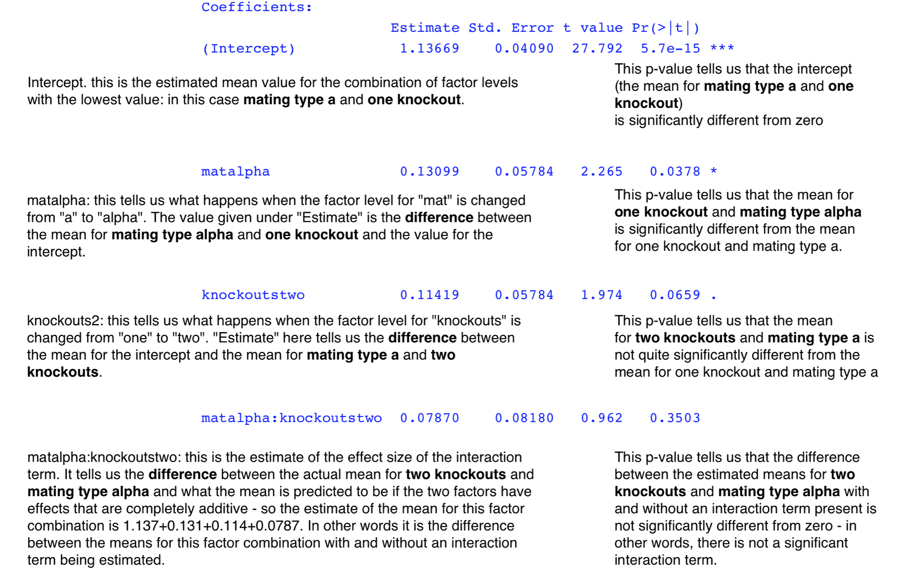

# Yeast sex and two factor ANOVA.

```{r echo = FALSE}
knitr::opts_chunk$set(collapse = TRUE, warning = FALSE, message = FALSE, comment = NA)
```

```{r echo=FALSE, cache=FALSE}
options(digits = 5)  ##Sets number of sig. figs to display output to
```


So far we've only thought about analysing data unsing ANOVA when there is only one _factor_. In the datasets we used up until now this factor was called F1 and had three _levels_, A, B and C. This kind of analysis is called a _single factor ANOVA_ or a _one way ANOVA_. ANOVA is not restricted to analysing the effects of just one factor, however, and you can in fact use ANOVA on data sets with several factors. This allows you to analyse the results of each factor seperately, and very importantly it also allows you to test for _interactions_ between your factors. An interaction is where the effect of one factor changes according to the level of another factor. 

As an example, if you were testing the effects of a particular dose of a drug on bacterial count in people with an infection you might test three different drug treatments: none (control), some (medium dose) and lots (high dose), and you might carry out your experiment on both male and female patients. This would give you a _two-factor ANOVA_, with one factor being "Treatment" with three levels and the second sex, with two levels. If you tested for an interaction term as well then you'd end up with an ANOVA table with three rows, one for the variance associated with each factor and one for variance associated with the interaction, as well as the row for the error variance.

The kind of patterns you can see with an interaction term are illustrated below. What you can see is that in each case where there is an interaction the effect of the drug treatment varies between the sexes. 

```{r echo=FALSE, fig.cap="Bacterial count for males (filled symbols) and females (open symbols) for the experimental design outlined above. There are effects of sex (females have fewer bacteria) and treatment but no interaction."}
X<-c("Control","Medium","High")
X1<-c(1,2,3)
Male<-c(22,17,12)
Female<-c(20,15,10)
plot(X1,Male,type="b",ylim=c(8,24),xaxt="n",pch=16,ylab="Bacterial count",xlab="Drug treatment",cex=2)
points(X1,Female,type="b",cex=2)
axis(side=1,at=c(1,2,3),labels=X)
```

```{r echo=FALSE, fig.cap="As for the previous figure but here there is also a signficant interaction term: the effects of drug treatment are much greater in females than in males."}
X<-c("Control","Medium","High")
X1<-c(1,2,3)
Male<-c(22,17,12)
Female<-c(20,12,4)
plot(X1,Male,type="b",ylim=c(2,24),xaxt="n",pch=16,ylab="Bacterial count",xlab="Drug treatment",cex=2)
points(X1,Female,type="b",cex=2)
axis(side=1,at=c(1,2,3),labels=X)
```
```{r echo=FALSE, fig.cap="As for the previous figure but here there is also a signficant interaction term: in this case the drug only has an effect in females."}
X<-c("Control","Medium","High")
X1<-c(1,2,3)
Male<-c(20,20,20)
Female<-c(20,15,10)
plot(X1,Male,type="b",ylim=c(2,24),xaxt="n",pch=16,ylab="Bacterial count",xlab="Drug treatment",cex=2)
points(X1,Female,type="b",cex=2)
axis(side=1,at=c(1,2,3),labels=X)
```
These are only a small subset of the wide range of possible patterns that can arise from an interaction between two factors. In the case of our drug trial example the potential importancde of understanding the potential interactions is obvious: if a drug works much better in one sex than the other then this will be vital knowledge for doctors making clinical decisions.

## Yeast sexual selection

For the rest of this chapter we're going to make a detailed look at how to carry out and interpret a 2-factor ANOVA in R. Firstly we need to run through some background. A fundamental component of the theories underlying our understanding of sexual selection is the assumption that sexual signalling is costly. If the expression of sexual signals like peacock’s tails, stag beetle mandibles or cricket song imposes a cost on the organism producing the signal then “honest signalling”, whereby the signaller does not attempt to pass himself (usually himself anyway) off as being of a higher quality than he actually is, can be maintained. The assumption that these signals are costly has rarely been tested, but in 2010 Carl Smith and Duncan Grieg [^18.1] published a paper describing the effects of sexual signalling on fitness in yeast, *Saccharomyces cerevisiae*. 

Yeast usually reproduces asexually as a diploid organism but occasionally produces haploid offspring by meiosis, and these haploid yeast cells can then either carry on reproducing asexually or fuse with another haploid yeast cell (this is the equivalent of mating) to produce a diploid daughter cell. The haploid yeast cells come in two types, MATa and MATα, which can be thought of as analogous to sexes. Each is attracted towards cells from the other mating type by pheromones which differ between mating types, and each pheromone is encoded by two separate genes which are only expressed in one or the other mating type. The α pheromone, for example, is encoded by genes called MFα1 and MFα2, which are only expressed in MATα cells. Smith and Grieg measured the fitness effects of producing these pheromones by producing yeast strains of both mating types that had either one or both pheromone genes deleted and then allowing them to compete with similar yeast strains that were still expressing both genes. Their results are shown in the following table, which the authors were kind enough to upload to the Dryad Digital Repository (Smith C, Greig D (2010) [Data from: The cost of sexual signalling in yeast.]http://datadryad.org/resource/doi:10.5061/dryad.1647 Dryad Digital Repository. doi:10.5061/dryad.1647). This dataframe can also be downloaded from http://www.introductoryr.co.uk.

```{r echo=FALSE, comment=NA, results='asis'}
library(xtable)

```

```{r  comment=NA}
load("Data/yeast.rda")

yeast
```
Table 1: Results of viability assays for strains of yeast with one or two pheromone genes knocked out in yeast from Smith and Greig (2010). “Fitness” is the growth rate of the knockout strain divided by the growth rate of a control strain with both pheromone genes expressed, “mat” is the mating type and “knockouts” is the number of pheromone genes knocked out. 

In order to understand the patterns in the yeast data we need to understand how mating type and the number of knockouts affects relative fitness, and we also need to know whether the effect of knocking out the pheromone genes depends on the mating type: in other words, we would like to know if there is an interaction between our two explanatory variables. Both explanatory variables are categorical rather than continuous, so the appropriate analysis here is a two-factor ANOVA. Before we leap straight into analysis, however, we should have a look at our data to give us an idea of what sort of patterns we’re looking at, and also so that we can pick up on any obvious problematic data points.

When we have more than one factor we can draw a useful boxplot by specifying that we want to look at an interaction, like this.

```{r fig.cap="Boxplots of fitness for the two mating types with one or two pheromone genes knocked out."}

boxplot(yeast$fitness ~ interaction(yeast$mat, yeast$knockouts),
        xlab = "Strain",
        ylab = "Relative fitness")
```

This gives us boxplots for the two one-gene knockout treatments first, and then the two-gene knockouts. We can immediately see that both the number of knockouts and the mating type seem to have an effect on fitness: the two-gene knockout strains have higher relative fitness than one-gene knockout strains, and the MATα strains have a greater response to the knockouts than the MATa strains. There aren’t any obvious serious outlying data points that might cause problems, and given that we only have a sample size of five the shape of the frequency distribution of the data for each treatment combination is fine - the individual boxplots are roughly symmetrical, and that’s about as good as we’re likely to get given the sample size.

One noticeable pattern that is a bit of a worry is that the variances seem to be different between the two mating types: the spread of the data is much greater for the two MATα treatments than for the two MATa ones. We can confirm this by calculating the variances.

```{r}
tapply(yeast$fitness, yeast$mat, var)
```
As everyone learns in their undergraduate statistics course, one of the assumptions of ANOVA is that variances are equal between treatments, but here they’re not. Do we need to worry about this? Well, one thing we also know is that ANOVA is generally quite robust to violations of these assumptions, especially if the other assumptions of the analysis are met. Given that we have equal sample sizes for all treatments and that the error distribution looks OK my thinking here is that we should go ahead with the analysis anyway, and then decide whether we have a problem on the basis of how the diagnostic plots for the analysis look and also how marginal the results are.

If we want to carry out an ANOVA in R then we have a couple of options. There is a dedicated function called `aov()`, which does ANOVA and nothing else, or we can use the `lm()` function which, as we’ve seen, fits a linear model. In fact, the `aov()` function carries out exactly the same calculations as the `lm()` function and the main difference between the two is the way the output is displayed. Let's start with `aov()`.

```{r}
yeast.aov<-aov(fitness ~ mat*knockouts, data = yeast)
```

We’ve set up an object called yeast.aov which contains the output from the `aov()` function specified. To tell `aov()` exactly what we want it to analyse we’ve used a formula in the same way as we did for the t-test and linear regression examples earlier, with a response variable on the left, then a tilda (~) and then our predictor variables. Because we're doing a two-factor ANOVA this time we’ve specified two predictor variables and we’ve used an asterisk to connect them. We could instead have written “fitness~mat+knockouts” but that would only have carried out an ANOVA with the main effects of mat and knockouts: the asterisk tells R to fit the main effects and all the interaction terms between the predictor variables specified.

```{r comment=NA}
summary(yeast.aov)
```

Using the `summary()` function then gives us a traditional ANOVA table, and we have significant effects of both mating type and the number of pheromone genes knocked out, but no significant interaction term: the effect of the number of knockouts doesn’t depend on the mating type.
Let's repeat the analysis but this time using `lm()`.

```{r}
yeast.lm<-lm(fitness ~ mat*knockouts, data = yeast)
```

This is exactly the same as for the `aov()` call, except the name of the function is different.

```{r comment=NA}
summary(yeast.lm)
```

The summary function gives us a lot more output with `lm()` than with `aov()`, and the output is rather different. We don’t get an ANOVA table: instead we get a table of estimated coefficients with a p-value calculated for each one. This table is quite complicated to interpret and the p-values are not the same as the p-values we get from `aov()`.


## Understanding the coefficients table

Looking back at the table we get from the `summary()` function, you might have noticed that there isn’t a traditional ANOVA table there, but there is a rather different and somewhat cryptic table labelled “coefficients”. This is one of the most important things to understand, but also not simple to master. I’ll try to explain how it works here.

The names of the rows associated with each coefficient might look a bit strange to you. We have an intercept, which you will be familiar with from regression but you might not have encountered in the context of an ANOVA before. Then we have a row called “matalpha”, which is the name of one of our factors and the name of one of its levels stuck together, then “knockoutstwo”: again a factor name and the name of one of its levels. Finally we get “matalpha:knockoutstwo”, both of the previous row names separated by a colon. Understanding where these names come from and what they mean is crucial to understanding this table and it is important if you want to go on to fit other models using R. They represent something called “treatment contrasts”, which are a way of showing the how the fitted model describes the patterns in the data. If you have the estimates from the treatment contrasts it’s possible to work out the predicted value for any combination of factors, continuous predictors and interactions. This is how they work.

Firstly, the intercept. In a simple linear regression this is exactly what it says on the tin. In the case of this ANOVA there’s not a y-intercept in the same sense as you get when there is a fitted line, and this intercept is in fact an estimated mean, or predicted value, for one of the combinations of factor levels in the analysis. More specifically, when you have a model that has one or more categorical factors but no continuous variable as predictors then the intercept is the estimated mean for the combination of factor levels that are assigned the lowest values by R. This is now getting even more confusing because these factor levels aren’t numbers, they’re “a” and “alpha” for factor “mat” and “one” and “two” for factor “knockouts”, so how can one have a lower value than the other, especially the first two?

What you need to know to understand what’s going on here is that R does in fact assign numbers to each level of a factor, and it assigns them in alphabetical order within each factor, so the factor level that comes first in alphabetical order is assigned “1”, the second “2” and so on. You don’t see these answers unless you ask but they’re there all the same. 

```{r}
as.numeric(yeast$mat)
as.numeric(yeast$knockouts)
```
You can see that the first 10 data points for “mat” have been given the number 2. These are the ones that are in the data frame as “alpha”, which comes after “a” in the alphabet. The second 10 data points correspond to “a” and have been given number 1. In the case of “knockouts”, the factor level “one” has had the number 1 assigned and the factor level “two” has the value 2. This is purely because of where the words come in alphabetical order and the assignment of the correct number to each word is merely serendipity.

```{r}
temp1<-c("one", "one", "two", "two", "three", "three")
temp1<-factor(temp1)
as.numeric(temp1)
```
In this example the word “two” has been assigned the number 3 because it comes after the word “three” in alphabetical order. “Three” has been assigned the number “two”. It’s alphabetical order and nothing else. Hopefully that’s clarified everything.

Back to the coefficients table. The intercept in this case is the estimated mean from the fitted anova for the combination of factor levels where both factors have the lowest assigned value. In this case that’s “a” (=1) for factor “mat” and “one” (=1) for factor “knockout”, so the row of the table called “intercept” gives us the estimated mean value for replicates with mating type a and one knockout. This is the “predicted value” for this combination of factor levels, in other words the value that we would predict from the model for a data point with these factor levels. 

Here's the coefficients table again

```{r echo=FALSE, comment=NA}
X1<-summary(yeast.lm)
X1$coefficients
```

Because we’re fitting a full model including an interaction term the predicted value for the Intercept is the same as the mean value for that combination of factor levels (mat=a and knockout=one)if we calculate it directly.

```{r comment=NA}
mean(yeast$fitness[yeast$mat=="a" & yeast$knockouts=="one"])
```

The t value calculated for this particular predicted value is simply calculated by dividing the estimate by the standard error, and the p-value associated with it gives us the helpful information that our mean fitness for this combination of factor levels is significantly different from zero.

Now that we know what the “intercept” row means, what about the next row?

The name of the row is “matalpha”, so it’s referring to the “alpha” level of the factor “mat”. No information about the level of “knockouts” it’s referring to though - it’s simply assumed that you know how these tables work. What this row tells us is the change in predicted value relative to the intercept that is a consequence of changing from the “a” factor level to the “alpha” factor level. In other words the value of the estimate here is a measure of the size of the main effect associated with the “mat” factor, so when we change from mating type a to mating type alpha the relative fitness increases, on average, by 0.13.  We can work out the predicted value for the one knockout, mating type alpha combination of factors by adding this estimate to that of the intercept.

```{r comment=NA}
1.13669+0.13099
```

We can check this by comparing it with the mean calculated just from these data for the measurements made on yeast with mating type alpha and one knockout:

```{r comment=NA}
mean(yeast$fitness[yeast$mat=="alpha" & yeast$knockouts=="one"])
```

We saw earlier that the p-value for the intercept tells us if the predicted value for the specific combination of factor levels that is defined as the intercept is different from zero. Because what we’ve estimated here is the change in predicted value, rather than the absolute predicted value, the t-test that we get for this row tells us not if the predicted value for one knockout and mating type alpha is different from zero, but rather whether the change in predicted value associated with changing from mating type a to mating type alpha is significantly different from zero. Looking at it another way, *it tells us if the predicted mean value for this factor level combination is significantly different from the intercept*. This is a bit more useful than the p-value for the intercept because it gives us a rough test of whether the effect of the change in factor levels is significant, but I emphasise that it’s a rough test and you should only use it as a guide. There’s more to come on which statistical tests should actually be used after we’ve finished deciphering the coefficients table.

Now let’s go on to the next row. This row is called “knockoutstwo”, and in the same way that the “matalpha” row gives us the estimate of the main effect of mating type, this gives us an estimate of the main effect of the number of knockouts - in other words, as we change from one knockout to two knockouts, we estimate that the relative fitness increases by 0.11. As before we can work out the predicted value, which is the mean for mating type a and two knockouts by adding this estimate to the intercept.

```{r comment=NA}
1.13669+0.11419
```

This is once again the same as the estimate for the simple mean for this factor combination.

```{r comment=NA}
mean(yeast$fitness[yeast$mat=="a" & yeast$knockouts=="two"])
```

We now know what the effects of both mating type and the number of knockouts is, so what’s the last row of the summary table there for? Here is the table again:

```{r echo=FALSE, comment=NA}
X1$coefficients
```

The last row, which is called “matalpha:knockoutstwo” is the effect of the interaction between the two factors. If you recall, we specified a model with interaction terms, and this is the estimate of the extra change in relative fitness that arises when we have mating type alpha and two knockouts, over and above the change in relative fitness form the main effects of the two factors. To calculate the estimated mean (in other words, the predicted value from the model) for this last factor combination we need to add the intercept, the main effects of both factors and the extra from the interaction term together.

```{r comment=NA}
1.13669+0.13099+0.11419+0.07870
```

Which is the same as the mean for that factor combination calculated separately.

```{r comment=NA}
mean(yeast$fitness[yeast$mat=="alpha" & yeast$knockouts=="two"])
```

Now you hopefully have an idea of how these tables of coefficients work. The intercept is the estimated value for the first factor level for each factor, then you get the main effects and then the interaction terms, and you can calculate a predicted value for each combination. One thing to note is that the predicted values will only tally with the directly calculated mean values if you have a fully factorial model - otherwise the estimates will differ somewhat. Here's that summary table again with everything annotated. 



***

## Which statistical tests to use with `lm()`?

We've seen earlier in this chapter that when we use the `summary()` function on an object that was the results of an analysis carried out with the `aov()` function we get a traditional ANOVA table, but when we use `summary()` on an object that is the output from a fitted model made using `lm()` we get p-values that are calculated for the effects estimated in the coefficients table. As I suggested earlier, there are a variety of reasons why you shouldn’t use these as a guide to which explanatory variables are significant: they are a useful indication of where the important effects can be found in the model but they are not reliable indicators of whether a variable is significant. If nothing else, when you have a factor with more than two levels you’ll get more than one separate p-value, one for each of the factor levels that isn’t included in the intercept. If you want to know the statistical significance of an explanatory variable and you’ve done an analysis of variance using `lm()`, you can get a nice ANOVA table from the fitted `lm()` model by using the anova() function [^18.2].

```{r comment=NA}
anova(yeast.lm)
```

That is identical to the table we got from the `aov()` function except some of the numbers are reported to more decimal places. Which function, then, should you use to carry out a straightforward ANOVA? I would recommend using `lm()` for the simple reason that an ANOVA really is just a small subset of the general linear model, and thinking about it as a model fitting exercise is probably a better way to approach the analysis than thinking about ANOVA as a separate, special kind of statistical test. The only thing that I know of that you can do if you use `aov()` that you can’t do if you use `lm()` is post-hoc testing using something like a Tukey’s HSD test (use the `TukeyHSD()` function on your fitted `aov()` object). Post-hoc testing is a very blunt instrument, however, and I think that most people nowadays would recommend looking at effect sizes and estimates of coefficients to help you interpret your data in most cases, and this is easier to do with an `lm()` fit.

## Diagnostics

We met the concept of diagnostic plots in chapter 11. The assumptions we make about our data are the same for ANOVA and as they are for regression (independence of data points, normal errors, homogeneous variances) with the exception of linearity which isn't an issue here because we're dealing with means rather than lines. We can bring up a set of diagnostic plots using the `plot()` function in the same way that we did for our regression models earlier: as we’ve seen earlier the output of `plot()` depends on what you put into it, and if we ask it to plot a model fitted with `aov()` or `lm()` it brings us a nice set of four diagnostic plots. Once again, the ones that we really need to look at here are the first two: a plot of fitted values vs residuals and a qq-plot.

```{r fig.width=8, fig.cap="Diagnostic plots for our fitted ANOVA. Fitted values versus residuals on the left and a qq-plot on the right."}

par(mfrow=c(1,2))

plot(yeast.lm, which=c(1:2))
```

On the right, our qq-plot which lets us assess whether our errors are normally distributed. The straightforward answer is “yes” - the points are almost all on the line. Point 8 is a little far from it but not a huge distance and it’s the only one, so I wouldn’t worry too much about that. On the left, however, our plot of residual values vs fitted values is a bit of a worry. It’s showing the classical fan shape that you get when your data are (that big word again) heteroscedastic: the variance is increasing with the fitted values, which in this case are the four estimated means. This is because of the differences in variance we noted earlier. Can we do anything about this? Well, the traditional thing to do when you have a pattern like this is to beat your data with a log-transformation in the hope of making things look nicer. What happens when we do that?

```{r}
yeast.lm.log<-lm(log(fitness) ~ mat*knockouts, data = yeast)
```

Sets up a new object with the analysis carried out on log-transformed data.

```{r}
anova(yeast.lm.log)
```


Looking at the ANOVA table there’s no real change when we use log-transformed data. The two main effects are still highly significant, and the interaction term is nowhere near significance. What about the diagnostic plots?

```{r anova9, fig.width=8, fig.cap="Diagnostic plots for the ANOVA performed on log-transformed data."}
par(mfrow=c(1,2))
plot(yeast.lm.log, which=c(1:2))
```

The residuals vs fitted values plot is maybe a bit better but the problem’s still there. Since the log transformation hasn’t fixed the problem, what are our options? There are several things we can do here.

1. We could use a different transformation: perhaps we could try an inverse transformation, or a Box-Cox transformation, or something, until we found a way of bashing our data into conforming.
2. We could use a non-parametric analysis that makes no assumptions about the distribution of the data - perhaps something like a Kruskal-Wallis test. Not ideal because the sample size is small and non-parametric tests aren’t as powerful as parametric ones.
3. We could use a model that makes different assumptions about the error distribution and that works well with heteroscedastic data. Maybe a generalized linear model with something like gamma errors would be OK. This is arguably the best option but it could get quite complicated quite quickly.
4. We can remember that, as we noted before, ANOVA is quite robust to violations of its assumptions, we can note that the results of the analysis are clear and neither complicated nor marginal, and we can stick with the original ANOVA.

In this case, my vote would go for the fourth option. We always have to remember that the purpose of statistical analysis is to help us understand the patterns in the data: the analysis is a means to an end, and not an end in itself. We could spend a while fitting a generalized linear model with the right error distribution, but would it tell us anything different from the ANOVA? Almost certainly not, so let’s stick with the simpler option.


## Visualising the data


What’s left? We could do with drawing a publication-standard graph illustrating the results, and summarising what we’ve found out. A bar plot with 95% confidence intervals is the sort of plot that you'd expect to see in a conference talk or a research paper describing these data. We need to start by setting up a matrix of means.

```{r}
yeast.mat<-tapply(yeast$fitness, list(yeast$mat, yeast$knockouts), mean)
yeast.mat
```

Now we need to know the 95% confidence intervals. These are calculated as:

$$ \Large \bar{x} \pm \left( \frac{\sigma}{\sqrt{N}} \right) t $$


Where $\bar{x}$ is the mean, $\sigma$ is the sample standard deviation, $N$ is the sample size and $t$ is the critical value of $t$ at $n-1$ degrees of freedom.

We can start with a matrix of standard deviations.

```{r}
yeast.sd<-tapply(yeast$fitness, list(yeast$mat, yeast$knockouts), sd)
yeast.sd
```

We can multiply the matrix by the square root of 5, which will give us the standard errors for each mean.

```{r}
yeast.se<-yeast.sd/sqrt(5)
yeast.se
```

Now we need to know the critical value of t at 4df. R will tell us this if we ask it nicely.

```{r}
qt(0.025,4)
```

To get the 95% confidence intervals now we just need to multiply the standard errors by 2.776.

```{r}
yeast.95s<-yeast.se*2.776
yeast.95s
```


Now we can draw our bar plot using the same approach that you saw in the graphs section. We’ll need to use arrows() to draw in the confidence intervals. Here’s the script I used:

First of all, set up a matrix with the locations of the centres of the bars for use in drawing the error bars.

```{r fig.show='hide'}
locations<-barplot(yeast.mat,beside=T)
```

Now draw the barplot. Note that I’ve specified the colours of the columns because the default options are a bit dark and make it hard to see the error bars. I’ve used `expression()` and `paste()` in the legend.text argument to put a greek letter in the mating type name, and I’ve used the args.legend= argument to put the legend in the top left corner without a box around it. I’ve cancelled the x-axis so that I can put in a new one with labels with capital letters, and I’ve made the axis labels and the text. on the axes bold (font=2) 

```{r eval=FALSE, fig.cap="Barplot showing means and 95% confidence intervals of fitness for each of the four yeast strains."}
barplot(
  yeast.mat,
  beside = TRUE,
  col = c("grey", "white"),
  legend.text = c("MATa", expression(paste("MAT", alpha))),
  args.legend = list(x = "topleft", bty = "n"),
  ylim = c(0, 1.8),
  ylab = "Relative fitness",
  xlab = "Number of pheromone gene knockouts",
  font.lab = 2,
  font.axis = 2,
  xaxt = "n"
)
```

Next draw the x-axis in with capitalised labels using the `axis()` function. How did I know where to put the labels (at=c(2,5))? I’m afraid I guessed on the basis of past experience…

```{r eval=FALSE}
axis(
  side = 1,
  at = c(2, 5),
  labels = c("One", "Two"),
  font = 2
)
```

Finally use `arrows()` to draw the positive and negative error bars

```{r eval=FALSE}
arrows(
  xo = locations,
  y0 = yeast.mat,
  x1 = locations,
  y1 = yeast.mat + yeast.95s,
  angle = 90,
  length = 0.1
)

arrows(
  x0 = locations,
  y0 = yeast.mat,
  x1 = locations,
  y1 = yeast.mat - yeast.95s,
  angle = 90,
  length = 0.1
)

```


```{r anova10, echo=FALSE, fig.cap="Barplot showing means and 95% confidence intervals of fitness for each of the four yeast strains."}
barplot(
  yeast.mat,
  beside = T,
  col = c("grey", "white"),
  legend.text = c("MATa", expression(paste("MAT", alpha))),
  args.legend = list(x = "topleft", bty = "n"),
  ylim = c(0, 1.8),
  ylab = "Relative fitness",
  xlab = "Number of pheromone gene knockouts",
  font.lab = 2,
  font.axis = 2,
  xaxt = "n"
)

axis(
  side = 1,
  at = c(2, 5),
  labels = c("One", "Two"),
  font = 2
)

arrows(
  locations,
  yeast.mat,
  locations,
  yeast.mat + yeast.95s,
  angle = 90,
  length = 0.1
)

arrows(
  locations,
  yeast.mat,
  locations,
  yeast.mat - yeast.95s,
  angle = 90,
  length = 0.1
)

```


[^18.1]: Smith, C. and Greig, D., (2010) The Cost of Sexual Signalling in Yeast, Evolution 64, 3114-3122

[^18.2]: As an aside, you’ll note that in R neither of the two functions that will actually fit an ANOVA, `aov()` and `lm()` are called “anova”, but there is a function called “anova()” which doesn’t fit an ANOVA. It does make sense if you’re a reasonably advanced statistician and you understand instinctively that an ANOVA is just one type of linear model, but if you’re a struggling undergraduate you’ll probably see this mostly as evidence of the perverseness of the software and possibly even as proof of a universal conspiracy to make your life miserable and confusing. Sorry.

