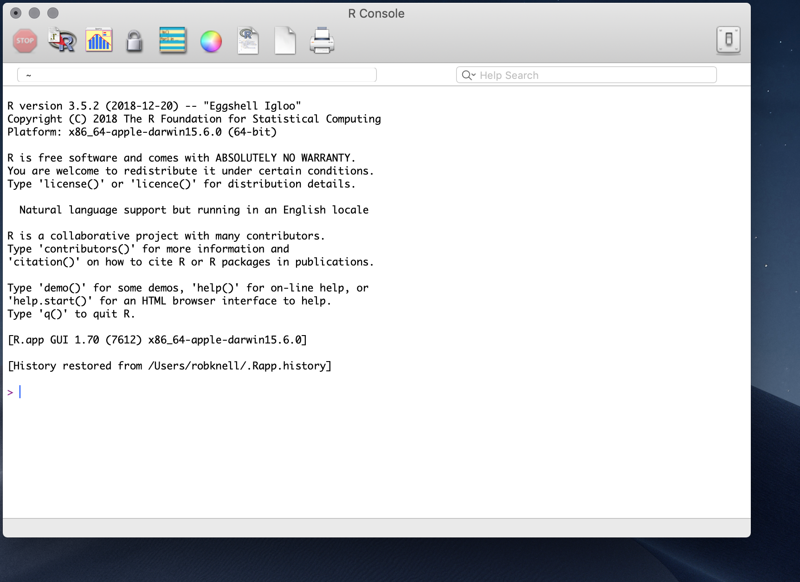

---
output:
  html_document: default
  pdf_document: default
---
# A first R session

```{r echo = FALSE}
knitr::opts_chunk$set(collapse = TRUE, warning = FALSE, message = FALSE, comment = NA)
```


## What is R?


In the beginning, Bell labs in the States developed a statistical analysis language called S. Nowadays S is a rare beast indeed. It is available as the commercially available package S-plus, but it's rare even to find S-plus these days. One reason for this is that everyone is using R. R is an open-source implementation of S. If you’re not familiar with the concept, open source software is not produced and sold by commercial bodies in the way that software such as Microsoft Office is: rather, it is usually written collaboratively by teams of volunteers and then distributed for free. It’s called open source because the source code is available and anyone can modify it and distribute it themselves if they conform to the requirements of the open source licence. R development is mostly done by the Core Development Team, who are listed here: [http://www.r-project.org/contributors](http://www.r-project.org/contributors.html). Thanks everyone for all your hard work.

R is a powerful programming language, and is designed specifically for data manipulation and for statistical analysis. As such, R comes with a broad set of built in tools for doing statistical analyses. In addition, the open-source nature of R means that as new statistical techniques are developed, new packages for R usually become freely available very soon after. There is R code available to do pretty much any sort of analysis that you can think of, and if you do manage to think of a new one you can always write the code yourself. On top of the almost infinite variety of statistical tools available, R is also equipped with a broad range of graph-drawing tools, which make it very easy to produce publication-standard graphs of your data. Because R is produced by people who know about data presentation, rather than graphic design, the default options for R graphs are simple, elegant and sensible, contrasting with the default options for graphics in certain other well-known data manipulation packages. On top of the base graphics system there are a number of additional graph packages available that give you whole new graphics systems and allow a further variety of graphics to be drawn easily. For a quick look at some of the variety of graphics that can be made in R have a look at some of the examples on show at [https://www.r-graph-gallery.com/](https://www.r-graph-gallery.com/). 

R is freely downloadable from [http://cran.r-project.org/](http://cran.r-project.org/), as is a wide range of documentation. If you’re using Windows or a Mac you can download it and run the installer. If you’re on Linux then check the software management system: you might have to do a bit of jiggery-pokery like specifying the repository, depending on the specifics of the distro you’re using. I’ll assume that if you’re using Linux then you can work all that out for yourself. 

If you're absolutely new to R, I would recommend starting out with just the base R installation which is what you will have just installed from CRAN. You might have come across some of the software tools which change the 'front end' of R which you work with, for example [RStudio](https://www.rstudio.com/) or [RKWard](https://rkward.kde.org/). RStudio is particularly popular --- I'm writing this on RStudio myself --- but it is a complicated interface which can cause confusion and there are some things you can do with RStudio which can cause problems if you don't know what you're doing. We'll talk about RStudio, RKWard and some other ways of using R later on once you're a bit more confident.

## A first R session

Go ahead and start R. The main R window that you’ll see when you start R is called the console. This is what it looks like when you are using a Mac, and on a PC it’s fairly similar.



There are a few buttons to click along the top of the console window, and some pull down menu options, but if you're used to Excel, or to SPSS or to many other data nadling and analysis programmes then you're probably feeling a bit lost. There's a bunch of text which is mostly legal blah and warnings, and then there's a marker for the start of a line indicated by `>`. This is the R **command prompt**: you can type instructions in here, and R will try to do what you're asked of it. Looking in the text above the command prompt there are a few things that might be  tempting including a suggestion that you type `help()` or `help.start()` to get some on-line help. This is not something that I'd recommend at this point because what you won't find anywhere is a beginner friendly guide to R for the worried.

So far then, you’ve downloaded a copy of R, you’ve started the application and now you’re faced with the command prompt without any nice buttons or menus to help you. This is the point where things usually start going pear-shaped for a good many people, and you might think that the other suggestion in the text above the command prompt, namely that you type `q()` to quit R might be the best option. Don't worry, and don't give up: we'll work through a simple analysis in an attempt to show you that it’s not as intimidatingly hard as you might think.

Let’s say you’re doing a research project investigating the effect of density on testosterone levels in a species of lizard. You have a data set from a single population with measurements from 12 male lizards. For each of these you’ve recorded the nearest neighbour distance as a measure of the population density experienced by that animal, and you’ve caught the lizards, taken a blood sample and measured the testosterone level.
Here are your testosterone data.

Lizard Number | Nearest Neighbour ($m$)  | Plasma testosterone ($ng.ml^{-1}$)
:-------:|:-----------------:|:-------------------------------:
1      |4                |22.2
2      |7                |26.1
3      |3                |21.5
4      |5                |23.8
5      |8                |23.8
6      |3                |20.5
7      |7                |24.6
8      |4                |22.6
9      |3                |19.9
10     |5                |23.9
11     |5                |19.8
12     |4                |21.3

Before doing any sort of analysis we need to get our data loaded into the programme. For a big data set you might do this by entering the data into a spreadsheet and importing it to R (see the “Importing data” chapter) but in this case, with a relatively small dataset you can enter the data directly at the command prompt. First, the nearest neighbour data. Just type this in at the command prompt and press enter.

```{r}
nearest.neighbour<-c(4,7,3,5,8,3,7,4,3,5,5,4)
```
This has created a set of numbers (a vector) in R called nearest.neighbour. The “c” before the brackets tells R to put everything in the brackets together, and the arrow <- means “take what’s to the right of the arrow and make an object with the name that’s to the left of the arrow”. You can check to make sure it’s correct by just typing the name and pressing enter. 

```{r}
nearest.neighbour
```

There’s your data. Don’t worry about the [1] at the start.
Now you need to do something similar for the testosterone data.

```{r}
testosterone<-c(22.2,26.1,21.5,23.8,23.8,20.5,24.6,22.6,19.9,23.9,19.8,21.3)
```
You can check your numbers here in the same way as before, by typing in the name of the object and pressing enter.
Now your data are entered into R you can take a look at them. It’s a good idea to visualise your data before doing any analysis, and you can do this by asking R to plot the data out for you. Type this and you’ll get a scatterplot.

```{r fig.cap="Testosterone titre plotted against the distance to the nearest neighbour"}
plot(nearest.neighbour,testosterone)
```

Not quite publication quality but not bad. You can look at the data and see that there does seem to be a positive relationship between nearest neighbour distance and testosterone level, and you can also see that there aren’t any data points that are huge outliers that are likely to have a big effect on your analysis. Now you can go ahead and do some analysis: you want to know if there’s a relationship between nearest neighbour distance and testosterone level, so you need to do a correlation analysis. More specifically, you want to know what the correlation coefficient _r_  is for the two variables and whether the correlation coefficient is significantly different from zero (see the chapter on correlation for more on this).
Type this in and press enter.

```{r}
cor.test(nearest.neighbour, testosterone)
```
This has everything you need. It tells you exactly what sort of analysis has been done, and the names of the variables you asked it to analyse. Then you get a significance test and a p-value, telling you that there is a statistically significant correlation between the variables. The last thing in the table is the actual estimate of the correlation coefficient (0.75) and you even get 95% confidence intervals for the estimate of r.
That’s it. You’ve input your data, drawn a graph and carried out a statistical test. This has hopefully illustrated some important points about how R works to you: you make it do things by typing commands and pressing enter; you can create data objects with your results in; there are commands that make R do things like carry out tests and draw graphs; and at least some of these commands have self-evident names like “plot”. You’ve probably also noticed that there seem to be an awful lot of brackets and commas, and you might have found out that if you make mistakes in what you’re typing the error messages are rarely helpful. You’re halfway there already, but if you want to gain your black belt in command prompt-jitsu you really need to go to the very beginning and start with the basics, which is what the next chapter is all about.