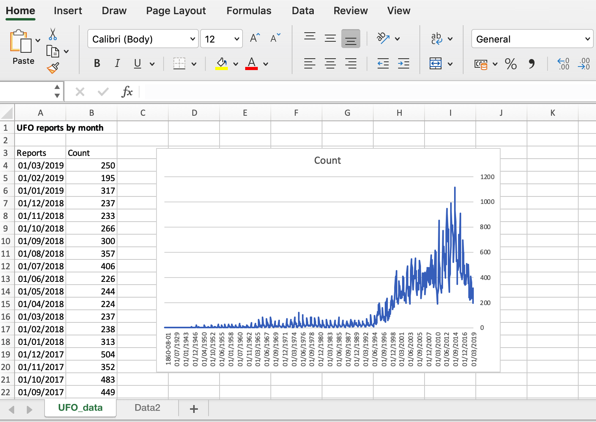

# Importing Data


Before you can start to explore your data, you need to load it into the R workspace. You can do this by entering it directly into the console or reading it from a script, but a lot of the time you'll be wanting to import data which yoyu prepared using another piece of software. Often this will be a spreadsheet such as Microsoft Excel or Google Sheets, or you might want to import data that's been saved as a file for a stats programme such as Stata or SPSS. Importing data is something that often trips people up because R is quite fussy about how it will import data, and if you try to import data that it doesn’t like you’ll find yourself in the usual quagmire of despair and not especially helpful error messages. The crucial trick to avoid this is to make sure that your data are prepared and formatted properly before you start trying to import it. I’ve written down a set of rules about how to organise your data, and If you follow these then you should be able to get it in a format that R will actually deign to read.

## The Rules


I’m assuming here that you’re compiling your data in a spreadsheet and that you’re planning to save it from the spreadsheet and import it into R.

**Rule 1. Each variable should be a single column, each row a single observation** In other words, if you’ve measured wing length and thorax width for three individuals each of three species of fly, you should have a single column for thorax width, a second for wing length data and another column for fly species, with each individual fly being a separate row. It should look like this:

| Species       | Thorax_width | Wing_length |
|---------------|:------------:|:-----------:|
| melanogaster  | 0.97         | 2.8         |
| melanogaster  | 0.88         | 3.1         |
| melanogaster  | 0.90         | 3.1         |
| simulans      | 0.88         | 2.5         |
| simulans      | 0.76         | 2.6         |
| pseudoobscura | 0.75         | 2.4         |
| simulans      | 0.80         | 2.5         |
| pseudoobscura | 0.91         | 3.1         |
| pseudoobscura | 0.79         | 2.9         |.

This way of organising data is usually called "long" form, and this is really standard for almost any kind of data analysis. The alternative is often called "wide" form and might look like this for our fly example:

| Species      | melanogaster | melanogaster | melanogaster | simulans | simulans | pseudoobscura | simulans | pseudoobscura | pseudoobscura |
|--------------|--------------|--------------|--------------|----------|----------|---------------|----------|---------------|---------------|
| Thorax_width | 0.97         | 0.88         | 0.90         | 0.88     | 0.76     | 0.75          | 0.80     | 0.91          | 0.79          |
| Wing_length  | 2.8          | 3.1          | 3.1          | 2.5      | 2.6      | 2.4           | 2.5      | 3.1           | 2.9           |

Don't do this.

**Rule 2. Represent missing data by the symbol "NA".**
You'll often have missing datapoints: if something didn't get measured properly, or if something got dropped, or if that entry in your field notebook is obscured by a mixture of mud, tears and blood. Different software uses different symbols to indicate a missing datapoint: Stata uses ".", for example. If you have missing data then the symbol for this in R is "NA", so if one of the thorax widths in the example above didn't get recorded (maybe the fly escaped between having its wings and its thorax measured) then your data should look like this.


| Species       | Thorax_width | Wing_length |
|---------------|:------------:|:-----------:|
| melanogaster  | 0.97         | 2.8         |
| melanogaster  | 0.88         | 3.1         |
| melanogaster  | NA           | 3.1         |
| simulans      | 0.88         | 2.5         |
| simulans      | 0.76         | 2.6         |
| pseudoobscura | 0.75         | 2.4         |
| simulans      | 0.80         | 2.5         |
| pseudoobscura | 0.91         | 3.1         |
| pseudoobscura | 0.79         | 2.9         |.

**Rule 3. Each column should be the same length.** Look at the bottom of your columns of data. Do they all end on the same line? If not then why not, since each line is an observation? You might have made a mistake somewhere in your data entry, so check this. You might need to make them the same length by adding "NA"s until they're all even.

**Rule 4. No spaces.** Variable names should not contain spaces. If you want to separate two parts of a variable name then use an underscore. "Horn length" can be replaced by "Horn_length". Don't start variable names with numbers or with symbols like $ or %. It'll just cause trouble.

**Rule 5. Remember** that R is **CASE SENSITIVE**. Your variable names should be consistent in their use of capitalisation, if you use it at all, and if you have character data then you need to be consistent there as well.

| Species       | Thorax_width | Wing_length |
|---------------|:------------:|:-----------:|
| melanogaster  | 0.97         | 2.8         |
| melanogaster  | 0.88         | 3.1         |
| melanogaster  | NA           | 3.1         |
| simulans      | 0.88         | 2.5         |
| simulans      | 0.76         | 2.6         |
| Pseudoobscura | 0.75         | 2.4         |
| simulans      | 0.80         | 2.5         |
| pseudoobscura | 0.91         | 3.1         |
| pseudoobscura | 0.79         | 2.9         |

If you imported this into R it would think you had four species: melanogaster, simulans, Pseudoobscura and pseudoobscura.

**Rule 6. Don't use variable names that are words that R is already using**, for example as function names. If you give a variable a name like "summary" or "factor" or "numeric" then things can go downhill very fast.

**Rule 7. Don't use zeros to code for a factor.** It just makes life complicated. Data can be either character, numerical for continuous variables (e.g. 2.456, 110), integer values coding for a factor  (1,2,3), text coding for a factor (male, female) or logical (TRUE,FALSE). Don't try and code something that you want R to treat as a factor as something like 0,1 & 2 for three different factor levels. 

Once you've organised your data frame in your spreadsheet, or whatever other editor you may wish to use, the best way to get it into R is to save it as a text file. R can read a variety of text formats, but it's simplest to use either tab-delimited text or comma separated values. If you’re using Excel you can do this by choosing "Save as" and then pulling down the "File Format" menu in the dialogue box. This will give you a bunch of options but you want either *Comma-separated values (.csv)* or *Tab-delimited Text (.txt)*. Most people nowadays use csv: it's up to you which one you choose, but I'll assume for the rest of this chapter that you're using csv.

## Importing your Text File


### The simple way

Now that you’ve saved your data in a format that R can read easily you can load it into R using the `read.csv()` command. There are a couple of ways of doing this. The simplest is to use a function called `file.choose()` in your `read.csv()` command, like this:
    
```{r eval=FALSE}
mydata<-read.csv(file.choose())
```

This will open a familiar, mouse-driven dialog window where you can navigate through your directory structure and find the file you’d like to load. If you’re lucky and everything is fine then when you click on the data file you want to import you won’t get any sort of message, just another command prompt, and there will be an object stored in R by the name of “mydata” that has all your data in it.

If you just use the `read.csv` function and don’t set up a new object using the allocation symbol then your data will just appear in the console window. It won’t be saved anywhere and you won’t be able to do anything with it once it’s appeared. If there’s something wrong with your data that makes R choke when it tries to read it you’ll get an error message

```{r eval=FALSE}
mydata<-read.csv(file.choose(), header=T)
```

```
Error in scan(file, what, nmax, sep, dec, quote,
skip, nlines, na.strings,  :   line 14 did not
have 5 elements
```

In this case the error message actually tells us something useful (enjoy it, it doesn’t happen often). Line 14 has the wrong number of elements - that probably means that there’s an entry on line 14 that’s either blank (i.e. missing data that’s not indicated by "NA") or has a space in it that it shouldn’t. You can go back and look at the line in question and see if you can spot the problem. One thing to remember is that the line number that R uses here is the line number not including the headers: if you look at your file in a spreadsheet the line number to check is line 15 because the spreadsheet will count the lines including the headers.

### The less simple way

Using `file.choose()` will get your data read into R and might well be enough for you, especially if you’re just starting out. If you’re likely to be saving things like graphs, scripts or copies of the workspace (we’ll get to all of those in time) to the same directory that your data file is in then it’s a good idea to set the “working directory” before you load the data in, which ensures that anything you save will go to the correct directory by default. If you’re using Windows or a Mac you can do this with a mouse. In Windows pull down the “File” menu and click on “Change dir…” to bring up a dialog box that you can use to specify the directory. On a Mac pull down the “Misc” menu and click on “Change Working Directory” or just press ⌘D. If you're using RStudio then pull down the "session" menu and you'll get a variety of options for setting the working directory.

If you're already familiar with directory structures then you can just use the `setwd()` command in R and type in a path. NB these are directory paths in the format you’d use for a Mac: if you’re using windows they’ll be a bit different.

```{r eval=FALSE}
setwd("~/Data/Experiment2")
```

You can check it’s worked using `getwd()`.

```{r eval=FALSE}
getwd()
```

```
[1] "/Users/RJKnell/Data/Experiment2"
```

If you’ve set the working directory and your data file is in that directory then you can load it by just using the name instead of `file.choose()`.

```{r eval=FALSE}
mydata<-read.csv("mydata.csv")
```

If for some reason you want to use a working directory which is not the one where your data file is stored you can put a directory path in the `read.table()` function.

```{r eval=FALSE}
mydata<-read.csv("~/myexperiment/mydata.csv")
```

## Importing character data

When you import a dataset with a variable contining character data the default option for `read.csv()` and also for `read.table()`, which you use for tab-delimited text, is to import the character variable as a factor. This is great if you rarely use chcracter data but often have factors in your data, but is otherwise **Very Annoying** and a lot of people seem to have curiously strong feelings about this. The way to fix it is to set the `stringsAsFactors` argument to `FALSE` which will make sure that all your character data are imported as such. If you have a mix of character data and factors you'll have to declare your factors as such, e.g.

```{r eval = FALSE}
mydata<-read.csv("~/myexperiment/mydata.csv", stringsAsFactors = FALSE)

mydata$Factor1 <- factor(mydata$Factor1)
```

## Data on the web

You don't have to restrict yourself to loading in data from a local drive. `read.csv()` and other, similar functions will happily accept a URL instead of a directory path. You've seen this already with the UFO data example, but just to remind you

```{r eval = FALSE}
UFO <- read.csv("http://www.introductoryr.co.uk/UFO_data.csv",
                stringsAsFactors = FALSE)
```

loads the UFO into an object called "UFO". Note that we have to set `stringsAsFactors` to `FALSE` to import character data without it being interpreted as a factor.


## Using `read.table()`

If you're using tab-delimited text, or text with some other kind of separator, then you might want to use the `read.table()` function rather than `read.csv()`. This will read tab-delimited text by default, but it differs from `read.csv()` in one important way: the default option with `read.table()` is to treat the first row of a set of data as the first row of data, rather than as the variable names. If you want to use your first row of data as variable names you need to set `header = TRUE` like this.

```{r eval = FALSE}
mydata<-read.table("~/myexperiment/mydata.txt", header = TRUE)
```


There are lots of other options for importing data into R - you can import SPSS data files or SQL database files for example. If you want to explore these more esoteric options there is a whole online manual here: http://cran.r-project.org/doc/manuals/R-data.html.

## What to do once you’ve managed to import your data.

Once you’ve got your data into R as an object you’ll want to make sure that it’s there in the form that you hope it’s in. There are a number of things you can do to check it. Most simply you can use the `names()` function, which will tell you what all the variable names are in "mydata". It's a useful check that everything's worked properly. If we use the Counts data frame that we looked at in the section on the `subset()` command in the choosing data section then we get this.

```{r}
Counts<-read.csv("Data/Counts.csv")
names(Counts)
```

`names()` doesn’t tell you much, though: if you want to know more about the data frame you’ve imported then the `str()` command will give you information about the structure of the data frame.

```{r}
str(Counts)
```

This is telling us lots of useful things. It gives us the number of variables in the data frame and how long they are. Then it tells us what those variables are called, and it gives us a bit of a summary each one. Importantly, we get told if a variable is numerical or whether it’s a factor (i.e. a categorical variable), and if it’s a factor we get told what he different levels are. This is well worth checking: if there’s a letter that’s capitalised differently in one entry, or a spelling mistake, then R will think it’s indicating a further level for the factor, and your analyses will all be wrong unless you detect it. If one of the entries for Temp has a lower-case “c” in “cold” rather than upper-case, for example, we would get the following output using `str()`.

```{r echo=FALSE}
Counts<-read.csv("Data/Counts2.csv")
```

```{r}
str(Counts)
```

You can see that the variable Temp is now listed as having 3, rather than 2 levels so you would be alerted to this potential problem.

One last option for inspecting your data is to use `head()`. This function returns the top six rows of a data frame or matrix, which lets you have a look at the top of your imported data and check whether everything’s as expected.

```{r echo=FALSE}
Counts<-read.csv("Data/Counts.csv",header=TRUE)
```

```{r}
head(Counts)
```

## Importing data directly from Excel

There are several R packages that make it possible to import data directly from an Excel spreadsheet, and even to write data from R to Excel. I'd recommend the `readxl` package which gives you a series of functions which work in a similar way to `read.csv()` and `read.table()`. You'll need to install the package and then load it before you can do anything else. This will install it:

```{r eval = FALSE}
install.packages("readxl")
```

and then you can load it like this.

```{r}
library(readxl)
```

Thinking back to our UFO example, let's assume that you've been tempted by the Dark Side and you've been doing stuff with your data in Excel. You might have a spreadsheet with a couple of sheets (UFO_data and Data2 in this case), with a heading that you don't want to import and some white space under it and maybe a graph or something similar.



You can tell the `read_excel()` function from the `readxl` package which sheet to read from and within that spreadsheet you can specify a range of cells to read from, so you can read the UFO data in like this:

```{r}
UFO <- read_excel("Data/UFO_data.xlsx", sheet = "UFO_data", range = "A3:B910")

str(UFO)
```

That worked nicely. Because I only included the data from 1900 onwards (you might rememebr that the dates for the years before those are in a different format) the "Reports" column has imported in the POSIXct class which is used to store dates and times. Nice!

A final point to make is that `readxl` is part of the `tidyverse` group of packages produced by Hadley Wickham and others at RStudio. One consequence of this is that the format of our imported data is not quite a normal data frame: rather it is something called a *tibble*. You can see this if you just type the name of the object: if we had a normal data frame with 907 rows then typing its name would print the whole thing to the screen, or at least quite a lot of it depending on exactly how you have R set up. With a *tibble* you get something different:

```{r}
UFO
```

The difference is that you just get the top 10 rows and then an indication of how many more there are. There are some other differences between a tibble and a data frame but don't worry about them for the moment: you can treat it like a data frame for almost everything, and if you find it misbehaving you can always convert it to a data frame.

```{r eval = FALSE}
UFO <- data.frame(UFO)
```

will do the trick.

## Other data formats

Data often comes in other formats, and there are options for importing directly from these as well. The `foreign` package will read files from a wide variety of statistical software including Minitab, SPSS, STATA and SAS. The `Hmisc` package includes functions which will import data from SPSS, SAS and Stata as well, and `haven` will import from and export to SAS, SPSS and Stata formats. To import data from a Google Sheet have a look for the `googlesheets4` package which is [currently in development](https://googlesheets4.tidyverse.org/). It's still a bit tricky in my experience so be warned.

```{r echo = FALSE}
knitr::opts_chunk$set(collapse = TRUE, warning = FALSE, message = FALSE, comment = NA)
```

## Importing data into RStudio

If you click on the 'Environment' tab in RStudio you'll find that there is a clickable "Import Dataset" option which gives you options for importing from a variety of formats including Excel, SAS, SPSS, and Stata as well as from standard text files. What this does is open a window which gives you a clickable interface that then runs either the functions to import text from Base R or the import functions for other file formats from either the `readxl` or `haven`packages. 


## To attach or not to attach?

If you’re doing a straightforward analysis and will only be using one data frame, you *might* want to “attach” your data set. 

```{r eval=FALSE}
attach(mydata)
```

This is a bit arcane, but it can be quite handy. What it does is to tell R to put the data frame "mydata" into its "search path". This means that if you type the name of a variable in the data frame you don’t need to tell R to look in the data frame to find it. For a data frame that is not attached you have to type the name of the data frame, a dollar sign and then the variable name: `mydata$variablename`, but if you attach the data frame you can just type `variable name`.

To check whether a data frame is attached you can check the search path by using the `search()` function. This shows you the various things that R searches to look for objects or functions through when it receives an instruction.

```{r echo=FALSE}
attach(Counts)
```

```{r}
search()
```   
```{r echo=FALSE}
detach(Counts)
```
In this example I’ve attached the data frame “Counts” and you can see it as the second item in the search path. To remove something from the search path use `detach()`.

Opinions are mixed as to whether attaching your data frame is a good idea. If you’re doing a big analysis and have several data frames, or if you’re using a big data frame and you’re subsetting parts of it to other objects for analysis then there’s a lot of potential for errors, and the likelihood of analysing the wrong bit of data by mistake is reduced when you have to specify the data frame for analysis every time. Once upon a time I would have recommended that you attach your data frame for simple analyses only, but I've got a bit more hardcore over the years and I really think it's just bad practice that will lead to trouble if you do it.

